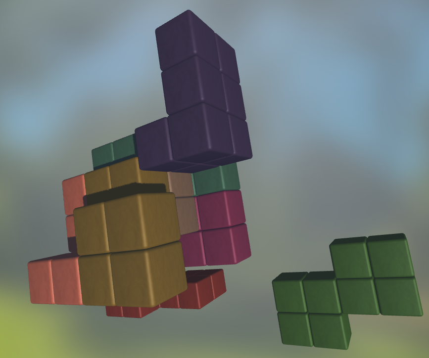

# Visual-computing-project-Block-Puzzle-Tool
Visual computing project application that allows the user to view puzzles in several different methods.

## Compiling
assuming cmake is installed on your system, executing the following commands will build the application. dependencies are already included under the libs folder, so this is not a concern. compilation is possible under both linux and windows. 

```
cmake -S . -B build
cd build
make
```

after this the application can be started by running the resulting executable.


## Application functions
This application has several different functions that allow for better understanding of the puzzle:

### Menu 

The controls for the application is performed using the menu, initially there will not be any puzzles on screen, but these can be loaded using the load solution button. 

The exploded view and solution steps cannot be shown at the same time. initially the step-by-step is enabled, and it can be shown using the designated slider. to enable the exploded view you can enable the checkbox appropriate checkbox. 

## Screenshots
### Exploded view


### Step by Step


### Piece selection


### Piece view
